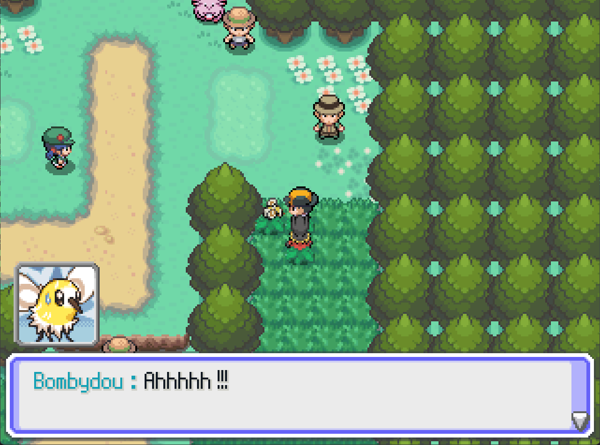

# MysteryDungeonPkmnFaces
A plugin developped for PSDK, that aims to show pokemon faces with different emotions during messages.

## Principle
This plugin is used to display various faces of pokemon, with different emotions, inside messages.



## Installation
The pokemon faces used by this plugin are stored in *graphics/pictures/pkmn_faces/portrait*, and the tracker used to chose which face to display is stored in *graphics/pictures.pkmn_faces*.

To use this plugin, you have to copy the folder *graphics* in the root folder of your project, and the script (.rb) or the release version (.psdkplug) in your scripts folder.
If you copied the .psdkplug, you then have to run :
```bash
psdk --util=plugin load
```

If you want to update the faces of this project, you can find them at https://github.com/PMDCollab/SpriteCollab. Then, you must replace your old portrait folder by the new one and your old tracker file by the new one;

## Credits

The face sprites are pulled from https://github.com/PMDCollab/SpriteCollab. You can also find the mandatory credits and licence to use them there.

I would also like that you credit me for the script (Lg-Marie07).


## Utilisation 
To display a face inside a message, you have to use, inside the box text of the message :

```bash
[pkmn_faces=position,expression,mirror,opacity!pkmn_id,pkmn_form,female,shiny]
```
The different parameters are :
  - position : x coordiantes of the face, between right (10), left (-10) or an integer. If the integer is negative, the sprite will be displayed from the right side of the window.
  - expression : string, face expression, between "Normal", "Happy", "Pain", "Angry", "Worried", "Sad", "Crying", "Shouting", "Teary-Eyed", "Determined", "Joyous", "Inspired", "Surprised", "Dizzy", "Special0" , "Special1", "Sigh", "Stunned", "Special2", "Special3". If the expression isn't found, an other expression, the nearest possible, will be chosen.
  - mirror (optional) : if the sprite should be mirrored
  - opacity (optional) : the opacity of the sprite
  - pkmn_id : name or id of the pokemon to display
  - pkmn_form (optional) : name of the pokemon form to show (between "Mega", "Gigantamax", "Alola", "Galar"...). For a more precised form, look at its name in the tracker.
  - female (optional) : if the sprite should be a female.
  - shiny (optional) : if the should be shiny.


Example : 
```bash
[pkmn_faces=left,Happy!pikachu]Hello !
```
```bash
[pkmn_faces=-10, sad, true!3,Mega,,true]Hi...
```

The pokemon parameters could be automatically computed, by using :
```bash
get_pkmn_data_for_pkmn_face(pokemon)
```

For example, if you want to display the face of your first pokemon : 
```bash
PFM::Text([POKE_INFOS], get_pkmn_data_for_pkmn_face($actors[0]))
```
```bash
[pkmn_faces=right,Happy,true![POKE_INFOS]]Hi, trainer !
```

Some pokemon forms aren't handled yet.

Moreover, this plugin also allow to display the name of the pokemon before the text. This fonctionnality can be changed by replacing *SHOW_PKMN_NAME = true* by *SHOW_PKMN_NAME = false*, in the beginning of the file MessagesFaces.rb. The color used by default to display the name is the 23rd.


### Français

## Principe
Ce plugin permet d'afficher des émotions de différents pokémon lors des messages. 


## Installation 
Les visages des Pokémons utilisés par le plugin sont stockés dans *graphics/pictures/pkmn_faces/portrait*, et le tracker permettant de choisir quel visage afficher dans *graphics/pictures/pkmn_faces*.

Vous devez donc copier le dossier *graphics* dans le dossier root de votre projet, ainsi que le script soit en version release (.psdkplug), soit en version script Ruby (.rb) dans votre dossier *scripts*.
Si vous avez copié le fichier .psdkplug, vous devez alors lancer la commande :
```bash
psdk --util=plugin load
```

Si vous souhaitez mettre à jour les visages utilisés, vous les retrouverez à l'adresse https://github.com/PMDCollab/SpriteCollab.
Il vous suffira de copier-coller le nouveau dossier portrait à la place de l'ancien, et de remplacer également le fichier de tracker.


## Crédits
Les sprites des visages sont tirés de https://github.com/PMDCollab/SpriteCollab. Les crédits obligatoires et la licence associés à leur utilisation y sont également disponibles.

J'apprécierais que vous me créditiez également pour le script (Lg-Marie07).

## Utilisation 
Pour afficher un visage avec un message, vous devez utiliser, à l'intérieur du texte du message :
```bash
[pkmn_faces=position,expression,mirror,opacity!pkmn_id,pkmn_form,female,shiny]
```
Les différents paramètres sont :
  - position : coordonnée x de la fenêtre, à choisir entre right (10), left (-10), ou un entier. Si l'entier est négatif, le sprite sera affiché depuis le côté droit de la fenêtre.
  - expression : string, expression du visage, parmis "Normal", "Happy", "Pain", "Angry", "Worried", "Sad", "Crying", "Shouting", "Teary-Eyed", "Determined", "Joyous", "Inspired", "Surprised", "Dizzy", "Special0" , "Special1", "Sigh", "Stunned", "Special2", "Special3". Si l'expression n'est pas trouvée, une autre expression, la plus proche possible, sera choisie.
  - mirror (optionnel) : vaut true si le sprite doit être mirror
  - opacity (optionnel) : opacité du sprite (de 0 à 255)

  - pkmn_id : id ou nom anglais du pokemon à afficher
  - pkmn_form (optionnel) : nom de la forme à afficher (parmis "Mega", "Gigantamax", "Alola", "Galar"...). Pour une forme plus précise, regardez son nom dans le tracker.
  - female (optionnel) : vaut true si le sprite à afficher est celui d'une femelle
  - shiny (optionnel) : vaut true si le sprite à afficher est shiny.

Example : 
```bash
[pkmn_faces=left,Happy!pikachu]Coucou !
```
```bash
[pkmn_faces=-10, sad, true!3,Mega,,true]Salut !
```

Les paramètres concernant les Pokémons peuvent être automatiquement calculés, en utilisant :
```bash
get_pkmn_data_for_pkmn_face(pokemon)
```

Par exemple, si vous souhaitez afficher la tête du premier pokémon de votre équipe :
```bash
PFM::Text([POKE_INFOS], get_pkmn_data_for_pkmn_face($actors[0]))
```
```bash
[pkmn_faces=right,Happy,true![POKE_INFOS]]Coucou !
```

Certaines formes ne sont pas encore gérées automatiquement :  pikachu, zarbi, mega mewtwo, morphéo, deoxys, cheniti/cheniselle, ceriflor,
motisma, arceus, bargantua, darumacho, vivaldaim, kyurem, meloetta, keldeo, genesect, prismillon, couafarel (pas de sprites), exagide, zygarde, hoopa, plumeline, lougaroc, silvallié, météno, nécrozma, salarsen, zacian/zamazenta, shifours, silveroy, paragruel (??), famignol, tapatoes, nigirigon, deusolourdo, mordudor, ogerpon, charmilly.

De plus, le plugin permet également d'afficher le nom du pokémon avant le texte affiché. Cette fonctionnalité peut être changée en remplacant *SHOW_PKMN_NAME = true* par *SHOW_PKMN_NAME = false*, au début du fichier MessagesFaces.rb.
La couleur utilisée pour afficher le nom est la 23ème.


